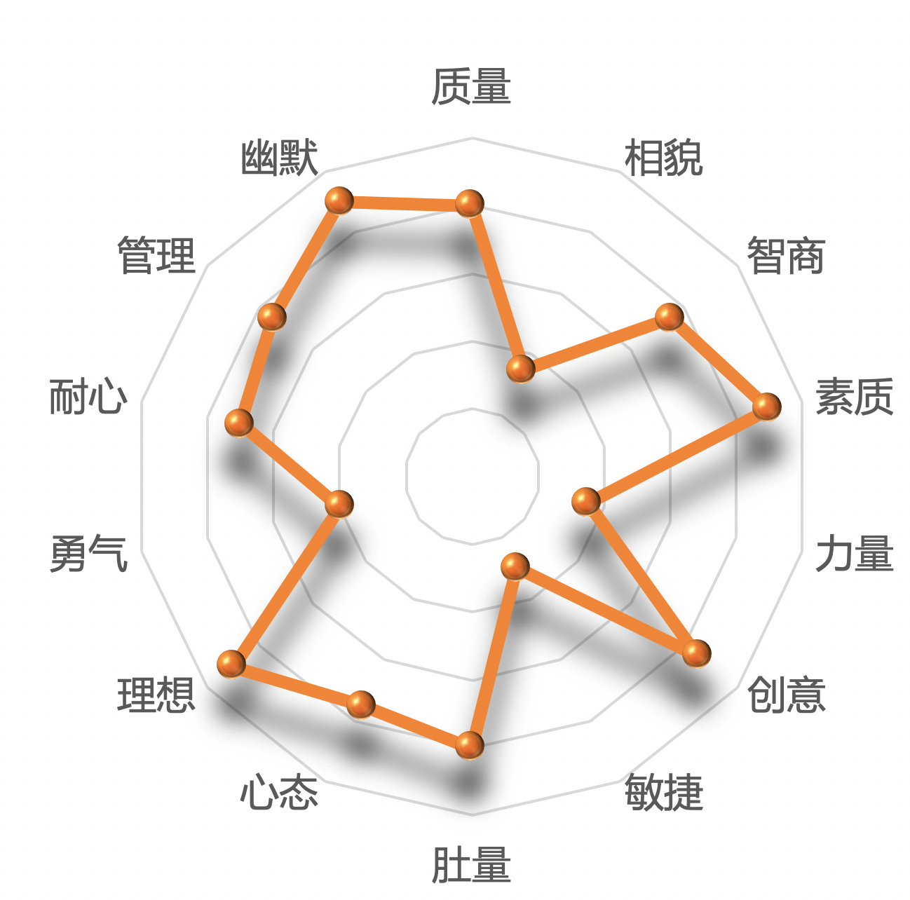

# 前言

这个回答的最初版本是在 2019 年 5 月写的，到目前 2020 年10月12日 为止，这 17 个月来一共有大约 13 个人私信过我（感谢你们对我的支持），**其中还包括一个 ♂ 的**。我不知道这位老哥是什么心态，反正我挺害怕的。

大部分私信我的人到最后，是因为我不知道该说什么，而失去联系了。没办法，内向又害羞的人就是这样，请大家多多包容，我本人不太会聊天，~~除了刷题以外好像也没别的事情可以讨论了~~。

至于为什么要来知乎写这个，因为我感觉我目前所处的环境是找不到老婆了——大学四年几乎没和女生说过话（除了班委问话这些），毕业后工作了也是如此。

**看了其他的回答，我承认在座的大部分都比我优秀，我自愧不如，但在这里我希望能找到一个像我一样普普通通的，靠谱一点就好了**。

我决定在今天重构一下，结束之前的内测版本，增加一些新特性并修复若干 BUG。总之，你将会看到一个前所未有的全新版本。

***后续有任何问题都可以在评论区或者私信问我！！！***  我都会一一认真回复。

---

# 目录

- 一票否决的情况
- 我的择偶标准
- 额外的期望
- 我的个人介绍

---

# 正文开始

### 一票否决的情况

以下几种情况是**绝对**不允许的：

0. 死的 || 男的 || 已婚的 
1. 怀过孕的
2. 抽烟的（我家已经达成公约，完全禁烟了）
3. 家庭存在罪犯或者邪教徒
4. 没上过大学的
5. 不吃猪肉的（容易自爆）
6. 存在明显的先天性不正常，比如连体人、三只眼、心脏在外面、多一只手臂（多几根手指可以接受）、具有两性生殖系统等
7. 超能力者（能力越大，责任越大）
8. 特殊怪癖好（包括严重的洁癖等）
9. 具有黑人基因
10. 有种族歧视的
11. 体重低于 50kg 的（和我差的太多了，我会很自卑的）
12. 没关注我或者没给我点赞的
13. 肖战粉丝
14. 只想谈恋爱不结婚的

------

### 我的择偶标准

0. 活的 &&  女的  && 没结婚的
1. 出生年份在 94 ~ 99 年之间（大姐姐如果看的上我也没问题，但是00后就不考虑了）
2. ***欣赏我的人***
3. **体重大于110斤**（我喜欢肉肉的，不希望太瘦，胖一点还能和我一起减肥）
4. 在杭州工作的
5. 家庭条件不要太好，普普通通最好（N套房的那种就勿扰了，希望能门当户对一点，我目前是**无房无车**）
6. 戴眼镜（戴隐形眼镜不太卫生），近视度数在400到800之间，这样比较正常
7. 独生子女（同龄人里非独生总觉得怪怪的）
8. 声音好听（**因为结婚后大部分时间都是听你骂声**，所以声音好听点我更容易妥协，减少纷争），相貌要求倒是无所谓
9. 学历越高越好（我希望彼此学识上的代沟能尽可能的小，不然会互相听不懂对方在说什么，聊着聊着会聊不下去）
10. 不喜欢化妆打扮自己的，因为我不太希望你过于成熟，和我差距过大
11. 温柔脾气好，能理解对方，不会故意不理人（有话就要说清楚，不要故意制造误解）
12. 经济观念和我接近，勤俭节约，不会乱花钱买奢侈品，慢慢存钱买房吧
13. 身体健康，心态要好，乐观生活，不忘初心，不离不去
14. 有基本素质，不随地吐痰，不随地大小便，公共场所不大声喧哗
15. 家庭和睦，父母健康，各种观念正常，相信科学不迷信（不会研究生辰八字、或者星座啥的）
16. 性格温善，诚实守信，会尊重人，有共情心

### 额外的期望

以下要求只是只是期望，没达到不要紧：

0. 理工科专业（像数学、计算机专业就更好了）
1. 喜欢读书，热爱学习，能和我一起讨论问题就更好了
2. 没有谈过恋爱的（谈过恋爱的估计看不上我）
3. 不依靠父母能通过自己奋斗，稳定养活自己并存钱，月薪税前在一万以上（如果还是学生，请无视这一条）
4. 父母居住在杭州本地的（周边萧山、余杭、临安、富阳也可以），不想逢年过节两地来回跑（我所有的亲戚都是杭州人，串个门都非常方便），至少过年必须得呆在杭州吧
5. 不下雨的时候不会撑伞的（晒晒更健康），我挺反感阴天还撑雨伞的人
6. 普通话标准，不带奇怪的口音（我除了和家里人，都是用普通话交流的）
7. 信仰和价值观正常，有一定的做人原则，有心怀天下的正义感
8. 乐于助人，积极参加志愿者一类的活动
9. 懂得欣赏电影艺术，并且看电影喜欢坐前排（前排人少安静，而且看的更清楚）
10. 过公历生日而不是农历
11. 非党员（我全家没有一个人是党员，你懂的）
12. 不打《王者农药》之类的手游（我工作很忙的，没时间陪你玩游戏，每天刷题都来不及）
13. 希望你有正确的审美观，**不要拍太白的照片**（不知道该怎么描述，总之越自然越好）
14. 关注时政大事，比如对美国总统选举以及叙利亚局势有独到的见解
15. 会至少一种编程语言，能和我一起刷题打比赛

### 我的个人介绍

- 性别男，94 年出生的，杭州人，家在上城区
- 我姓王，**接受同姓恋**（同姓多好，生孩子全跟你姓我也没意见）
- 你可以叫我 wc
- 家庭和睦，父母都是普通市民（妈妈退休了 爸爸还要两年）
- 家庭构成：奶奶、外公、外婆、爸爸、妈妈都健在，妈妈这边有1个妹妹和1个哥哥（我有1个表姐），爸爸这边有1个哥哥3个姐姐（我有1个堂姐，1个表哥2个表姐）
- 肥宅一个，身高 165cm，体重不到 170 斤（肚量很大，已经在积极减肥了，最胖的时候到了210斤）
- 相貌出众，**一定是人群中最丑的那个**，并且从不打扮自己，什么穿衣风格从不在意
- ~~不会游泳（只学了换气），你和我妈都救不了~~
- 目前**无车无房**，但是要结婚了肯定会得到父母的资助（毕业后工作两年了，存了几十万了，但离买房还很远）
- 本科学历，计算机专业
- 职业是中小学算法竞赛教练（**你想学算法我可以教你**），年薪是保密的不能公开说（大概多少你应该能猜到）
- **个人优势**：学习能力强，擅长教育，**以后教育小孩子的工作包在我身上了，孩子升学问题都不需要操心**
- 有丰富的投资经历，基金经常买到最高点（wc反买，别墅靠海），买币亏了90%
- 业余爱好：骑车、看电影
- 芝麻信用 797（不知道什么原因，三年没涨了），**诚实守信坚守原则**
- 不抽烟，不喝酒，不纹身，不烫头，无不良嗜好，**唯一的缺点就是上进心太强**
- 从未有过女朋友（也没有交往过男朋友），**性取向正常**
- 一直都想找女朋友，但是周围实在接触不到女生，而我又内向很胆小，**从不主动和别人说话**
- 从小到大，我不一定是一个集体中最优秀的那个人，但一定是最有创意（最奇葩）的那个人
- 喜欢做另类的事情，从不随波逐流
- 喜欢六神花露水的味道，那是童年的感觉
- 吃白切鸡不蘸酱油，喜欢原味的东西（包括薯片）
- 讨厌香菇、醋、韭菜、大蒜、麻油、葱等食物
- 平时一般会用QQ聊天，微信都是工作上用的
- 我现在唯一找女朋友的方式就是**守株待兔**了，我相信总能有人欣赏我的
- 下图简单展现了我的基础属性，仅供大致上的参考

# 写在最后

上面这个图切实反映了我的基本属性，本来是找工作时写到我的简历里的。

我不是程序员，更不是算法工程师，我是专门研究算法竞赛的。

上面的择偶标准写了很多，但是并不需要全部达到，写的多只能说明我对找老婆这件事**非常慎重**。

如果有一点非常优秀，比如学历非常高或者CF2400以上，**那其他条件就都不重要了**。

之前有些联系我的女生，家里条件实在太好了，过于优秀导致我无地自容，我只想单纯地找一个能与我一起奋斗的。

**希望大家帮我转发和介绍，滴水之恩必当涌泉相报。**

有任何意见都可以在评论区反馈

知乎连接：https://www.zhihu.com/question/312858530/answer/671996163

github：https://github.com/WCSB/FindWife